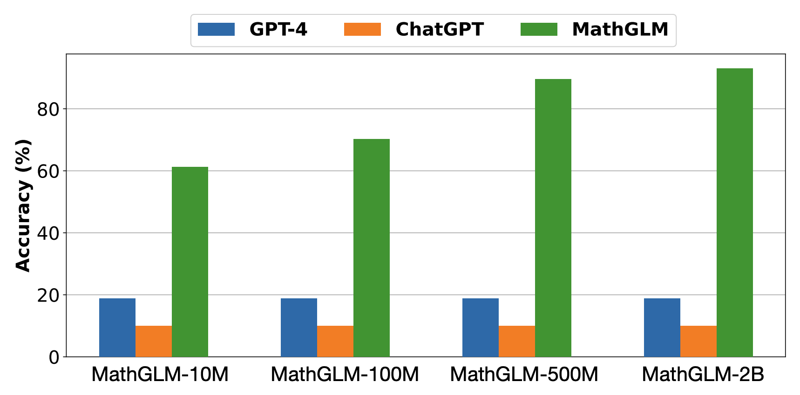
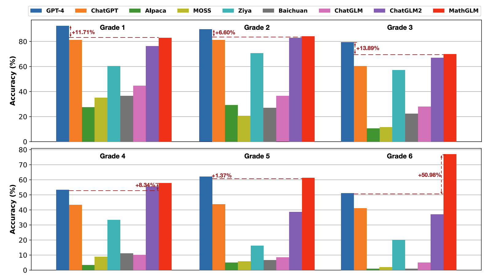

## GPT Can Solve Mathematical Problems Without a Calculator <br><sub>Official Pytorch Implementation</sub>



Previous studies have typically assumed that large language models are unable to accurately perform arithmetic operations, particularly multiplication of >8 digits, and operations involving decimals and fractions, without the use of calculator tools. This paper aims to challenge this misconception. With sufficient training data, a 2 billion-parameter language model can accurately perform multi-digit arithmetic operations with almost 100% accuracy without data leakage, significantly surpassing GPT-4 (whose multi-digit multiplication accuracy is only 4.3%). We also demonstrate that our MathGLM, finetuned from GLM-10B on a dataset with additional multi-step arithmetic operations and math problems described in text, achieves similar performance to GPT-4 on a 5,000-samples Chinese math problem
test set.


If you want to find the detailed introduction, Read our paper: [GPT Can Solve Mathematical Problems Without a Calculator](https://arxiv.org/pdf/2309.03241v2.pdf).

# Demo

## Arithmetic Tasks


## Math Word Problem


# Model Download 


## Arithmetic Tasks
| Model    | Download | 
| --------- | --------------- |
| MathGLM-10M   |  [THU-Cloud](https://cloud.tsinghua.edu.cn/d/16a914d6db2a4b8f80f5/)          | 
| MathGLM-100M  |  [THU-Cloud](https://cloud.tsinghua.edu.cn/d/a6ca369a212c4df08359/)          | 
| MathGLM-500M  |  [THU-Cloud](https://cloud.tsinghua.edu.cn/d/c80046ec7e234be4831b/)          | 
| MathGLM-2B    |  [THU-Cloud](https://cloud.tsinghua.edu.cn/d/cf429216289948d889a6/)          | 


## Math Word Problem

| Model   | Backbone Model | Model Size | Download | 
| --------- | ---------- | ---------------- |---------------- |
| MathGLM-Large       | GLM-Large    |335M   | [THU-Cloud](https://cloud.tsinghua.edu.cn/d/3d138deaf93441b196fb/)         | 
| MathGLM-10B         | GLM-zh-10b   | 10B   | [THU-Cloud](https://cloud.tsinghua.edu.cn/d/bc3c7b5c46304c2b88f6/)         | 
| MathGLM-ChatGLM-6B  | ChatGLM-6B   | 6B    | [THU-Cloud](https://cloud.tsinghua.edu.cn/d/92127e3a1b4144db8d13/)         | 
| MathGLM-ChatGLM2-6B | ChatGLM2-6B  | 6B    | [THU-Cloud](https://cloud.tsinghua.edu.cn/d/ab7eaac27ebd4d088834/)         | 


# Setup

### Environment
Our MathGLM relies on sat(SwissArmyTransformer), please ``` pip install SwissArmyTransformer ```.

Download the repo and setup the environment with:

```bash
git clone https://github.com/THUDM/MathGLM.git
cd MathGLM
conda env create -f env.yml
conda activate mathglm
```
#### Note
For arithmetic tasks and MathGLM-10B: deepspeed==0.6.0; For math word problems on MathGLM-6B: deepspeed==0.9.5


### Dataset

For arithmetic tasks, please download pre-training dataset from [MathGLM-dataset](https://cloud.tsinghua.edu.cn/d/8d9ee3e52bb54afd9c16/). For amth word problem, the reconstructed Ape210K dataset is provided in ```MathGLM_MWP/dataset/data.jsonl```


## Inference 

For arithmetic tashs, you can directly execute the following command to evaluate our MathGLM on the provided test dataset that contains 9592 test cases:

```bash
cd MathGLM_Arithmetic
./inference.sh
```

For math word problem, you can evaluate our MathGLM on the Ape210K test dataset that contains 5000 test Chinese math word problems. You can run the following  command:

```bash
cd MathGLM_MWP
./inference.sh
```


### Performance Reproduction

MathGLM achieves competitive results in comparison with the most powerful large language model GPT-4 and ChatGPT.

| Model   | ACC | RE | 
| --------- | ---------- | ---------------- | 
| GPT-4 | 18.84%    | -             |
| ChatGPT  | 10.00%    | -            | 
| MathGLM-10M  | 61.21%    | 97.83%            | 
| MathGLM-100M  | 70.28%    | 99.28%            | 
| MathGLM-500M  | 89.57%    | 99.41%            | 
| MathGLM-2B  | 93.03%    | 99.71%            | 

MathGLM-10B achieves similar performance to GPT-4 on a 5,000-samples Chinese math problem test set.
| Model   | Arithmetic_ACC | Answer_ACC | 
| --------- | ---------- | ---------------- | 
| GPT-4 | -  | 59.57%            |
| ChatGPT  | -   | 39.78%        | 
| MathGLM-Large  | 62.00%   | 50.80%            | 
| MathGLM-GLM-6B  | 64.60%   | 48.06%            | 
| MathGLM-10B  | 69.08%    | 58.68%            | 
| MathGLM-GLM2-6B  | 52.24%   | 45.48%           | 
| MathGLM-ChatGLM-6B  | 58.52%    | 42.28%           | 
| MathGLM-ChatGLM2-6B  | 50.38%    | 43.14%           | 

## Pre-training

For arithmetic tashs, run command:

```bash
cd MathGLM_Arithmetic
./pretrain.sh
```

For math word problem, run command:

```bash
cd MathGLM_MWP
./continue.sh
```


## Citation

```
@article{yang2023gpt,
  title={GPT Can Solve Mathematical Problems Without a Calculator},
  author={Yang, Zhen and Ding, Ming and Lv, Qingsong and Jiang, Zhihuan and He, Zehai and Guo, Yuyi and Bai, Jinfeng and Tang, Jie},
  journal={arXiv preprint arXiv:2309.03241},
  year={2023}
}
```
